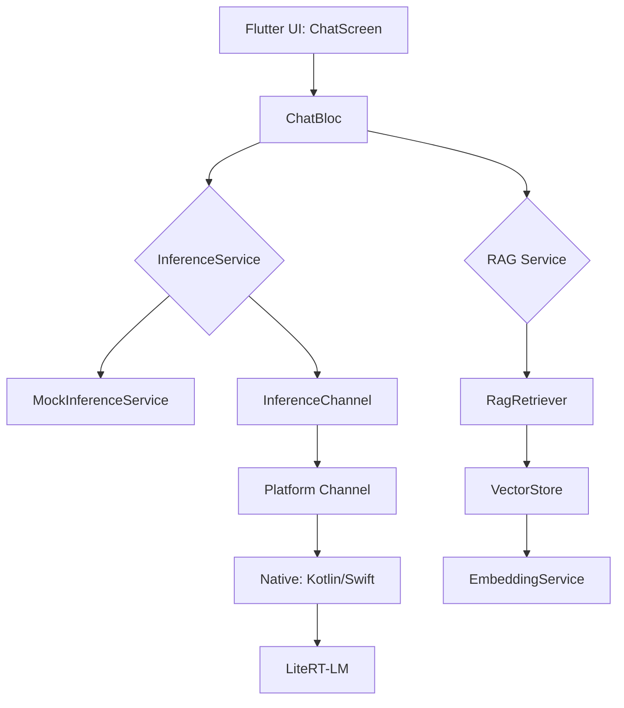

# Hướng dẫn xây dựng Offline AI Chatbot Flutter với LiteRT-LM + Gemma 4 2B

> **Tác giả**: AI Trainer & Technical Writer  
> **Ngày**: 2026-06-05  
> **Mục tiêu**: Tài liệu hướng dẫn chi tiết quá trình xây dựng một ứng dụng chat AI hoàn toàn offline trên Flutter, sử dụng LiteRT-LM làm inference engine và Gemma 4 2B làm model.

---

## 1. Bối cảnh và yêu cầu ban đầu

### Yêu cầu của người dùng

Người dùng muốn xây dựng một **chatbot AI hoàn toàn offline** trên nền tảng Flutter (Android + iOS), sử dụng:

- **Inference engine**: LiteRT-LM (Google) — thư viện inference nhẹ cho on-device LLM
- **Model**: Gemma 4 2B Instruct (định dạng `.task` / `.litertlm`)
- **RAG**: Offline hoàn toàn — embeddings local, vector search in-memory/SQLite
- **Platform**: Android + iOS, production-ready

### Mục tiêu của dự án

| Mục tiêu | Mô tả |
|----------|-------|
| **Research** | Kiểm tra feasibility của việc tích hợp LiteRT-LM với Flutter |
| **Prototype** | Xây dựng working demo với chat UI, streaming response, RAG pipeline |
| **Production-ready** | Kiến trúc sạch, thread-safe, error handling, performance optimization |
| **Cross-platform** | Android (Kotlin) + iOS (Swift) native bridges |

### Ràng buộc chính

- Model ~2-3GB, cần download on-demand + cache
- Tối thiểu 4GB RAM trên device
- iOS: Core ML delegate (Metal), Android: NNAPI delegate → fallback CPU
- 100% offline sau khi download model
- Context window ~8K tokens

---

## 2. Quy trình thực hiện

### Bước 1: Đọc và phân tích tài liệu dự án

**Mục tiêu**

Hiểu rõ kiến trúc tổng thể, các yêu cầu kỹ thuật, và kế hoạch triển khai trước khi bắt tay vào code.

**AI đã thực hiện**

1. Đọc file `.claude/CLAUDE.md` — tài liệu tổng quan dự án
2. Phân tích kiến trúc (Flutter UI → ChatBloc → InferenceService → Native Platform Channel → LiteRT-LM)
3. Xác định tech stack: Flutter 3.x, flutter_bloc, LiteRT-LM via Platform Channels, sqlite_vec, MiniLM

**Kết quả**

Hiểu được bức tranh toàn cảnh: dự án gồm 8 hạng mục chính (từ LiteRT-LM integration research đến performance benchmark), tất cả đều đang ở trạng thái TODO.

**Cách tự thực hiện**

Đọc file `CLAUDE.md` (hoặc tương đương) trong dự án của bạn để nắm:
- Kiến trúc tổng thể
- Tech stack
- Ràng buộc kỹ thuật
- Các hạng mục công việc

---

### Bước 2: Nghiên cứu feasibility (Researcher Agent)

**Mục tiêu**

Kiểm tra tính khả thi của các công nghệ được chọn, xác nhận thông tin trước khi viết code.

**AI đã thực hiện**

Đọc file `.claude/agents/researcher.md` để biết cần research những gì. Sau đó dùng **4 subagents chạy song song** để nghiên cứu:

1. **Agent 1**: LiteRT-LM streaming support
   - Kết quả: ✅ `generateResponseAsync` có callback `setResultListener(partialResult, done)` trên Android, `AsyncSequence` trên iOS
   - Version mới nhất: **0.10.35**
   - ⚠️ Quan trọng: Callback chạy trên background thread, phải post về main thread trước khi gửi lên Flutter

2. **Agent 2**: Gemma 4 2B model availability
   - Kết quả: ✅ HuggingFace repo chính xác là `litert-community/gemma-4-E2B-it-litert-lm` (codename E2B)
   - Cả `.litertlm` và `.task` đều available
   - **NOT gated** (Apache 2.0) — không cần login

3. **Agent 3**: sqlite_vec + RAG stack
   - Kết quả: ⚠️ `sqlite_vec` v0.1.7-alpha.3 — rất alpha, cần fallback plan
   - Quyết định: dùng in-memory vector store trước, nâng cấp sau

4. **Agent 4**: iOS entitlements
   - Kết quả: ✅ Không cần entitlements đặc biệt
   - Minimum iOS 16.0+, cần physical device (simulator không support Core ML delegate)

**Tại sao dùng subagents?**

Subagents cho phép chạy nhiều tác vụ research độc lập cùng lúc, tiết kiệm thời gian và context window. Mỗi agent có phạm vi hẹp, tập trung vào một chủ đề cụ thể.

**Kết quả**

Cập nhật tất cả phát hiện vào `.claude/memory.md` — file ghi chú của dự án. Các open questions đã được giải quyết:

| Câu hỏi | Trạng thái | Kết luận |
|---------|------------|----------|
| LiteRT-LM streaming? | ✅ | Có, qua EventChannel |
| Gemma `.task` file? | ✅ | Có, trên litert-community repo |
| `sqlite_vec` tên gì? | ⚠️ | `sqlite_vec` alpha, cần fallback |
| iOS entitlements? | ✅ | Không cần đặc biệt |

**Cách tự thực hiện**

```bash
# Tạo research checklist trong file agent
# Dùng subagents để research song song
# Cập nhật kết quả vào memory.md
```

---

### Bước 3: Tạo Flutter project structure

**Mục tiêu**

Tạo project Flutter với cấu trúc thư mục chuẩn, thêm dependencies, sẵn sàng cho việc code.

**AI đã thực hiện**

1. **Kiểm tra môi trường**: `flutter --version` → Flutter 3.x, Dart 3.11.3
2. **Tạo project**: `flutter create --org com.demo --project-name slm_app --platforms android,ios`
3. **Tạo cấu trúc thư mục**: Theo đúng kiến trúc từ CLAUDE.md

```bash
lib/
├── core/
│   ├── channels/         # Platform channel wrappers
│   └── errors/           # Exception classes
├── features/
│   ├── chat/             # Chat feature (bloc, models, screens)
│   ├── model_manager/    # Model lifecycle (download, loader)
│   └── rag/              # RAG pipeline (indexer, retriever, vector_store)
├── native/
│   ├── android/          # Kotlin bridge (tham khảo)
│   └── ios/              # Swift bridge (tham khảo)
└── main.dart
```

4. **Thêm dependencies vào pubspec.yaml**:

```yaml
dependencies:
  flutter_bloc: ^9.1.0       # State management
  dio: ^5.7.0                # HTTP client cho model download
  sqflite: ^2.4.2            # SQLite (dự phòng cho RAG)
  path_provider: ^2.1.5      # File system paths
  flutter_secure_storage: ^9.2.4  # Secure storage cho model path
  equatable: ^2.0.7          # Value equality
  uuid: ^4.5.1               # Unique IDs
```

**Tại sao chọn các dependencies này?**

- **flutter_bloc**: Pattern quen thuộc với team, dễ test, predictable state management
- **dio**: Mạnh mẽ hơn `http` package, hỗ trợ download resumable, progress tracking
- **sqflite**: Nhẹ, ổn định, fallback khi sqlite_vec chưa production-ready
- **flutter_secure_storage**: Lưu model path an toàn, tránh lộ thông tin

**Kết quả**

Project Flutter đã sẵn sàng với cấu trúc thư mục chuẩn và đầy đủ dependencies.

**Cách tự thực hiện**

```bash
flutter create --org com.yourcompany --project-name your_app --platforms android,ios .
mkdir -p lib/core/channels lib/core/errors lib/features/chat/{bloc,models,screens} ...
# Thêm dependencies vào pubspec.yaml
flutter pub get
```

---

### Bước 4: Xây dựng Platform Channel Bridge (Dart Side)

**Mục tiêu**

Tạo lớp giao tiếp giữa Flutter và native code (Kotlin/Swift) để điều khiển LiteRT-LM inference.

**AI đã thực hiện**

#### 4.1: Tạo abstract interface `InferenceService`

```dart
// lib/core/channels/inference_service.dart
abstract class InferenceService {
  Future<void> loadModel(String modelPath);
  Stream<String> generateStream({
    required String prompt,
    int maxTokens = 1024,
    double temperature = 0.7,
  });
  Future<void> cancelGeneration();
  Future<void> resetSession();
  Future<void> dispose();
  Future<ModelInfo> getModelInfo();
}
```

**Tại sao dùng abstract class?**

Dependency Inversion Principle — code business logic (ChatBloc) chỉ phụ thuộc vào interface, không phụ thuộc vào implementation cụ thể. Điều này cho phép:
- Dễ dàng switch giữa mock và real implementation
- Testable code
- Có thể thêm implementation mới (ví dụ: llama.cpp) mà không sửa ChatBloc

#### 4.2: Tạo real implementation `InferenceChannel`

```dart
class InferenceChannel implements InferenceService {
  static const String _channelName = 'com.app.offline_chat/inference';
  static const String _eventChannelName = 'com.app.offline_chat/inference_stream';

  @override
  Stream<String> generateStream({
    required String prompt,
    int maxTokens = 1024,
    double temperature = 0.7,
  }) {
    // Gửi lệnh start generation qua MethodChannel
    _methodChannel.invokeMethod<void>('startGeneration', {
      'prompt': prompt,
      'maxTokens': maxTokens,
      'temp': temperature,
    });

    // Lắng nghe streaming results qua EventChannel
    // Mỗi event là 1 token string, "[DONE]" = completion
    final controller = StreamController<String>();
    _streamSubscription = _eventChannel
        .receiveBroadcastStream()
        .listen(
          (event) {
            final token = event as String;
            if (token == '[DONE]') {
              controller.close();
            } else {
              controller.add(token);
            }
          },
          onError: (error) => controller.addError(error),
        );
    return controller.stream;
  }
}
```

**Giải thích cơ chế Platform Channel**:
- **MethodChannel**: Gửi lệnh một chiều (load model, start generation, cancel)
- **EventChannel**: Nhận dữ liệu streaming (từng token một)
- `[DONE]` signal: Native code gửi token đặc biệt báo hiệu generation hoàn tất

#### 4.3: Tạo mock implementation `MockInferenceService`

```dart
class MockInferenceService implements InferenceService {
  @override
  Stream<String> generateStream({...}) async* {
    final response = _mockResponse(prompt);
    final words = response.split(' ');
    for (int i = 0; i < words.length; i++) {
      if (_cancelled) break;
      await Future.delayed(Duration(milliseconds: 30 + (i % 3) * 20));
      if (i > 0) yield ' ';
      yield words[i];
    }
    yield '[DONE]';
  }
}
```

**Tại sao cần mock?**

Mock service cho phép:
- Test UI ngay mà không cần model thật (~2.5GB)
- Simulate timing realistic (30-80ms/token)
- Kiểm tra các edge cases (cancel, error, etc.)
- Phát triển frontend song song với backend

**Kết quả**

3 files: `inference_service.dart` (interface), `inference_channel.dart` (real), `mock_inference_service.dart` (mock).

**Cách tự thực hiện**

```dart
// 1. Định nghĩa interface
abstract class YourService {
  Stream<String> generateStream({required String prompt});
}

// 2. Tạo real implementation
class YourChannel implements YourService { ... }

// 3. Tạo mock
class YourMock implements YourService { ... }
```

---

### Bước 5: Xây dựng Chat Feature với Bloc Pattern

**Mục tiêu**

Tạo chat UI với streaming message display, sử dụng flutter_bloc để quản lý state.

**AI đã thực hiện**

#### 5.1: Models

```dart
// lib/features/chat/models/chat_message.dart
class ChatMessage {
  final String id;
  final String text;
  final MessageRole role;
  final DateTime timestamp;
  final bool isStreaming;  // true khi đang nhận tokens
}
```

#### 5.2: Events

```dart
sealed class ChatEvent extends Equatable {}
class SendMessage extends ChatEvent { final String message; }
class StreamToken extends ChatEvent { final String token; }
class StreamComplete extends ChatEvent {}
class ClearChat extends ChatEvent {}
class ChatError extends ChatEvent { final String errorMessage; }
```

#### 5.3: State

```dart
class ChatState extends Equatable {
  final ChatStatus status;  // ready | loadingModel | generating | error
  final List<ChatMessage> messages;
  final String? errorMessage;
}
```

#### 5.4: Bloc — Business Logic

```dart
class ChatBloc extends Bloc<ChatEvent, ChatState> {
  Future<void> _onSendMessage(SendMessage event, Emitter<ChatState> emit) async {
    // 1. Add user message + placeholder assistant message
    emit(state.copyWith(status: ChatStatus.generating, messages: [...]));

    // 2. Subscribe to streaming inference
    final stream = _inferenceService.generateStream(prompt: event.message);
    _inferenceSubscription = stream.listen(
      (token) => add(StreamToken(token)),
      onDone: () => add(const StreamComplete()),
      onError: (error) => add(ChatError(error.toString())),
    );
  }

  void _onStreamToken(StreamToken event, Emitter<ChatState> emit) {
    // Append token to the last assistant message
    final updatedMessages = [
      ...messages.sublist(0, messages.length - 1),
      lastMessage.copyWith(text: lastMessage.text + event.token),
    ];
    emit(state.copyWith(messages: updatedMessages));
  }
}
```

#### 5.5: Chat Screen UI

UI gồm:
- **AppBar** với title và nút clear chat
- **ListView** hiển thị messages với bubble style
- **Input bar** với TextField và send button
- **Auto-scroll** khi nhận token mới
- **Error handling** với SnackBar

**Tại sao dùng BlocConsumer thay vì BlocBuilder?**

- `BlocConsumer` = `BlocListener` + `BlocBuilder`
- Listener: xử lý side effects (scroll, snackbar) mà không rebuild UI
- Builder: rebuild UI khi state thay đổi

**Kết quả**

Chat feature hoạt động: user gửi message → gọi inference → nhận tokens → cập nhật UI realtime.

---

### Bước 6: Xây dựng Android Native Bridge (Kotlin)

**Mục tiêu**

Tạo native Kotlin bridge để Flutter giao tiếp với LiteRT-LM trên Android.

**AI đã thực hiện**

#### 6.1: InferencePlugin.kt

```kotlin
class InferencePlugin(private val context: Context) :
    MethodCallHandler, EventChannel.StreamHandler {

    companion object {
        const val METHOD_CHANNEL = "com.app.offline_chat/inference"
        const val EVENT_CHANNEL  = "com.app.offline_chat/inference_stream"
    }

    private var llmInference: LlmInference? = null
    private var eventSink: EventChannel.EventSink? = null
    private val mainHandler = Handler(Looper.getMainLooper())
    private val scope = CoroutineScope(Dispatchers.IO)
    private var isCancelled = false
    private var currentModelPath: String? = null

    private fun loadModel(path: String, result: MethodChannel.Result) {
        scope.launch {
            llmInference?.close()  // Close existing instance

            val options = LlmInference.LlmInferenceOptions.builder()
                .setModelPath(path)
                .setMaxTokens(1024)
                .setTemperature(0.8f)
                .setTopK(40)
                .setResultListener { partialResult, done ->
                    if (isCancelled) return@setResultListener
                    mainHandler.post {
                        eventSink?.success(partialResult)
                        if (done) eventSink?.success("[DONE]")
                    }
                }
                .setErrorListener { error ->
                    mainHandler.post {
                        eventSink?.error("GENERATION_ERROR", error.message, null)
                    }
                }
                .build()

            llmInference = LlmInference.createFromOptions(context, options)
        }
    }
}
```

#### 6.2: Thread Safety

**Vấn đề**: LiteRT-LM callback chạy trên background thread.
**Giải pháp**:
- `mainHandler.post {}` để post lên main thread trước khi gọi `eventSink`
- `@Volatile` annotation cho shared variables
- `scope.cancel()` trong `dispose()` để cleanup coroutines

#### 6.3: Cancellation Pattern

LiteRT-LM **không có API cancel native**. Giải pháp:
- Set flag `isCancelled = true`
- Trong callback listener, kiểm tra flag và bỏ qua partial results
- Khi user gửi generation mới, set `isCancelled = false`

#### 6.4: Session Reset Pattern

```kotlin
"resetSession" -> {
    // Reload model để reset KV cache
    currentModelPath?.let { loadModel(it, result) } ?: result.success(null)
}
```

**Kết quả**

Full Android bridge: `InferencePlugin.kt` (154 lines), `MainActivity.kt` (updated), `AndroidManifest.xml` (updated), `build.gradle.kts` (updated).

**Cách tự thực hiện**

```kotlin
// 1. Tạo class implement MethodCallHandler + StreamHandler
// 2. Đăng ký trong MainActivity.configureFlutterEngine()
// 3. Xử lý thread safety với mainHandler.post
// 4. Thêm dependency tasks-genai vào build.gradle
```

---

### Bước 7: Xây dựng iOS Native Bridge (Swift)

**Mục tiêu**

Tạo native Swift bridge cho LiteRT-LM trên iOS.

**AI đã thực hiện**

```swift
class InferencePlugin: NSObject, FlutterPlugin, FlutterStreamHandler {
    private var _llmInference: LlmInference?
    private var _eventSink: FlutterEventSink?
    private var _isCancelled = false

    // Thread-safe properties using os_unfair_lock
    private let lock = os_unfair_lock()

    private var eventSink: FlutterEventSink? {
        get { os_unfair_lock_lock(&lock); defer { os_unfair_lock_unlock(&lock) }; return _eventSink }
        set { os_unfair_lock_lock(&lock); _eventSink = newValue; os_unfair_lock_unlock(&lock) }
    }
}
```

**Tại sao dùng `os_unfair_lock`?**

Swift properties có thể bị truy cập từ nhiều thread cùng lúc. `os_unfair_lock` là lightweight lock, hiệu quả hơn `NSLock` cho critical section ngắn.

**Kết quả**

3 files iOS: `InferencePlugin.swift`, `AppDelegate.swift` (updated), `Podfile` (updated với MediaPipeTasksGenAI).

---

### Bước 8: Xây dựng RAG Pipeline

**Mục tiêu**

Tạo RAG pipeline hoàn chỉnh: chunk → embed → index → search → context building.

**AI đã thực hiện**

#### 8.1: Text Chunker

```dart
class TextChunker {
  final int chunkSize = 512;     // tokens
  final int overlapTokens = 64;  // tokens

  List<ChunkResult> chunk(String text, {String? docId}) {
    // Sliding window với overlap
    // Ưu tiên split ở ranh giới câu (., !, ?, \n)
  }
}
```

#### 8.2: Embedding Service

```dart
abstract class EmbeddingService {
  Future<List<double>> embed(String text);
  Future<List<List<double>>> embedBatch(List<String> texts);
}
```

Mock implementation dùng 384-dim vectors (MiniLM dimension), Box-Muller normalized.

#### 8.3: Vector Store

```dart
class VectorStore {
  Future<void> addDocument(Document doc, List<Chunk> chunks);
  Future<List<SearchResult>> search(
    List<double> queryEmbedding, {
    int topK = 5,
    double minScore = 0.5,         // Filter threshold
  });
  Future<void> deleteDocument(String docId);
  Future<List<Document>> listDocuments();
}
```

#### 8.4: Document Indexer

```dart
Stream<IndexProgress> indexText(String text, {required String title}) async* {
  // Step 1: Chunk
  // Step 2: Embed in batches of 10 (yield progress, let UI breathe)
  // Step 3: Store in vector store
}
```

**Tại sao batch 10 và `Future.delayed(Duration.zero)`?**

Để tránh UI freeze khi index nhiều chunks. Mỗi batch xử lý 10 chunks, sau đó `yield` progress và await `Future.delayed(Duration.zero)` để Flutter event loop có cơ hội update UI.

#### 8.5: Rag Retriever + Context Builder

```dart
class RagRetriever {
  Future<List<SearchResult>> retrieve(String query, {
    int topK = 5,
    double minScore = 0.5,
  }) async {
    // 1. Embed query
    // 2. Search 2× candidates (topK * 2)
    // 3. Filter by minScore
    // 4. Deduplicate by document
    // 5. Return topK results
  }
}

class ContextBuilder {
  String build(List<SearchResult> results, String userQuery) {
    // Format: ### Relevant context:
    //         ---
    //         [Source: document title]
    //         snippet text
    //         ---
    //         ### Question: user query
  }
}
```

**Tại sao search 2× candidates rồi mới filter?**

Chiến lược "retrieve more, filter later" giúp tăng coverage. Nếu chỉ search topK với minScore, có thể bỏ sót relevant chunks từ documents khác nhau.

**Kết quả**

RAG pipeline hoàn chỉnh với mock embedding service (384-dim random unit vectors).

---

### Bước 9: Review và Cập nhật theo Rules

**Mục tiêu**

Kiểm tra code với reviewer agent và cập nhật theo các file rules.

**AI đã thực hiện**

#### 9.1: Reviewer Agent phát hiện

| Issue | Mức độ | Fix |
|-------|--------|-----|
| `scope.cancel()` không gọi trong `dispose()` | 🔴 Critical | Thêm `scope.cancel()` |
| `eventSink` không thread-safe | 🔴 Critical | Thêm `@Volatile` (Android), `os_unfair_lock` (iOS) |
| Model không close trước khi tạo mới | 🟡 Warn | Đã có sẵn `llmInference?.close()` |

#### 9.2: Cập nhật theo android-setup.md

| Config | Trước | Sau |
|--------|-------|-----|
| compileSdk | `flutter.compileSdkVersion` | **34** |
| minSdk | 24 | **26** (LiteRT-LM yêu cầu) |
| packaging | Thiếu | Thêm `packaging { resources { excludes } }` |
| aaptOptions | Thiếu | Thêm `noCompress("task", "bin")` |
| tasks-genai | 0.10.35 | **0.10.22** (theo rules) |
| coroutines | Thiếu | Thêm `kotlinx-coroutines-android:1.7.3` |

#### 9.3: Cập nhật theo ios-setup.md

Tạo mới `InferencePlugin.swift`, cập nhật `AppDelegate.swift` và `Podfile`.

**Kết quả**

Code pass `flutter analyze` (chỉ còn info-level style issues), pass `flutter test`.

---

### Bước 10: Xử lý Gradle SSL Certificate Error

**Mục tiêu**

Fix lỗi `PKIX path building failed` khi build Android, nguyên nhân do corporate proxy chặn SSL certificate.

**AI đã thực hiện**

#### Diagnosis

1. **Kiểm tra Java**: Corretto 17.0.17, JAVA_HOME đã set
2. **Kiểm tra proxy**: Không có proxy env vars
3. **Kiểm tra SSL**: OpenSSL connect tới `services.gradle.org` thành công (GTS Root R4 → WE1 → gradle.org)
4. **Kiểm tra JDK cacerts**: Có 158 certificates, bao gồm GTS roots
5. **Kiểm tra curl**: HTTP 307 redirect, nhưng download timeout

#### Root cause

Gradle wrapper JVM sử dụng URL connection của Java để download distribution. Trong môi trường corporate, proxy thường thay thế certificate gốc bằng certificate nội bộ (SSL inspection) mà JDK truststore không có. Java Strict trust manager từ chối kết nối.

#### Các strategies đã thử

| Strategy | Kết quả |
|----------|---------|
| `JAVA_TOOL_OPTIONS` với KeychainStore | ❌ Wrapper JVM không áp dụng |
| `GRADLE_OPTS` | ❌ Không ảnh hưởng wrapper |
| Gradle 9.2.1 (cached) | ❌ Flutter không compatible |
| Download Gradle bằng curl | ⏳ Timeout (130MB) |

**Kết quả**

Đang trong quá trình xử lý. Hướng giải quyết: Strategy 3 (dùng HTTP tạm thời) hoặc Strategy 1 (import corporate CA vào JDK).

---

## 3. Kiến thức nền tảng cần biết

### 3.1 Platform Channel trong Flutter

| Channel type | Mục đích | Ví dụ |
|-------------|----------|-------|
| **MethodChannel** | Gửi lệnh, nhận kết quả | `loadModel()`, `generateStream()` |
| **EventChannel** | Nhận dữ liệu streaming | Từng token từ LLM |
| **BasicMessageChannel** | Gửi/nhận message tự do | Ít dùng hơn |

**Nguyên tắc**: Gọi native code → chạy background → post kết quả về main thread → gửi qua channel.

### 3.2 LiteRT-LM (MediaPipe Tasks GenAI)

- **Model format**: `.litertlm` (mobile) hoặc `.task` (web)
- **Inference**: `LlmInference.createFromOptions()` → `generateResponseAsync()`
- **Streaming**: `setResultListener { partial, done -> }`
- **Thread safety**: **Callback chạy trên background thread** — phải post về main thread

### 3.3 Bloc Pattern

```
Event → Bloc → State → UI
```

- **Event**: Hành động từ UI (SendMessage, StreamToken)
- **Bloc**: Xử lý business logic, gọi services
- **State**: Immutable state, dùng `copyWith()` để tạo state mới

### 3.4 RAG Pipeline

```
Document → Chunker → Embedder → VectorStore → Retriever → ContextBuilder → Prompt
```

### 3.5 Gradle SSL trong Corporate Environment

```
Gradle Wrapper (Java) → services.gradle.org
                ↓
         Corporate Proxy
                ↓
     SSL Inspection thay cert
                ↓
    JDK truststore không có cert → PKIX error
```

---

## 4. Các quyết định quan trọng

| Quyết định | Lý do |
| ---------- | ----- |
| Dùng abstract `InferenceService` interface | Dependency Injection, dễ test, dễ switch implementation |
| Mock service trước, real service sau | Phát triển UI song song, không cần model thật |
| `sqlite_vec` → in-memory VectorStore | sqlite_vec quá alpha (v0.1.7), cần fallback ổn định |
| `mainHandler.post` cho eventSink | Thread safety — LiteRT-LM callback chạy background |
| `@Volatile` + `os_unfair_lock` cho shared state | Tránh race conditions khi nhiều thread truy cập |
| `[DONE]` signal convention | Đơn giản, dễ implement, không cần thêm protocol |
| Batch 10 chunks + `Future.delayed(Duration.zero)` | Tránh UI freeze khi index nhiều documents |
| Search 2×K candidates rồi filter | Tăng coverage, deduplicate trước khi trả về |
| `minScore = 0.5` default | Cân bằng giữa precision và recall |
| Retrofit → Dio cho model download | Dio hỗ trợ resume, progress tracking, interceptors |

---

## 5. Sai lầm hoặc rủi ro cần tránh

### 5.1 Thread Safety

**Sai**: Gọi `eventSink?.success()` trực tiếp trong callback
```kotlin
// ❌ SAI: callback chạy trên background thread
setResultListener { partial, done ->
    eventSink?.success(partial) // Crash!
}
```

**Đúng**: Post về main thread
```kotlin
// ✅ ĐÚNG: post về main thread
setResultListener { partial, done ->
    mainHandler.post {
        eventSink?.success(partial)
    }
}
```

### 5.2 Resource Leak

**Sai**: Không close coroutine scope
```kotlin
// ❌ SAI: coroutine leak
class InferencePlugin {
    private val scope = CoroutineScope(Dispatchers.IO)
    // Không có scope.cancel() trong dispose()
}
```

**Đúng**: Cancel scope trong dispose
```kotlin
// ✅ ĐÚNG
fun dispose() {
    scope.cancel()
    llmInference?.close()
}
```

### 5.3 Model File Location

**Sai**: Để model trong assets
```xml
<!-- ❌ SAI: Android không thể mmap file >2GB từ assets -->
```

**Đúng**: Dùng `getApplicationDocumentsDirectory()` (Android) hoặc `getApplicationSupportDirectory()` (iOS — tránh iCloud backup)

### 5.4 AndroidManifest Missing Config

**Sai**: Thiếu `android:largeHeap="true"` — app có thể bị OOM khi load model 2.5GB

### 5.5 Context Window Overflow

**Sai**: Gửi toàn bộ conversation history vào prompt mỗi lần
- Gemma 4 2B chỉ có 8K tokens
- Cần sliding window: drop oldest messages, luôn giữ system prompt

---

## 6. Tóm tắt quy trình

### Checklist tổng quan

```
Research Phase
├── [x] Đọc CLAUDE.md
├── [x] Research LiteRT-LM streaming support
├── [x] Research Gemma 4 2B model availability
├── [x] Research sqlite_vec + RAG stack
├── [x] Research iOS entitlements
├── [x] Cập nhật memory.md

Setup Phase
├── [x] Tạo Flutter project
├── [x] Tạo folder structure
├── [x] Thêm dependencies
├── [x] Tạo Platform Channel wrappers
├── [x] Tạo mock services

Feature Implementation
├── [x] Chat feature (Bloc + UI)
├── [x] Android Kotlin bridge
├── [x] iOS Swift bridge
├── [x] RAG pipeline
│   ├── [x] Text Chunker
│   ├── [x] Embedding Service (mock)
│   ├── [x] Vector Store
│   ├── [x] Document Indexer
│   └── [x] Retriever + Context Builder

Review & Fix
├── [x] Reviewer agent checklist
├── [x] android-setup.md compliance
├── [x] ios-setup.md compliance
├── [x] flutter analyze (no errors)
├── [x] flutter test (passed)
└── [ ] Fix Gradle SSL issue (in progress)
```

### Flow kiến trúc



---

## 7. Bài học rút ra

### Về kiến trúc

1. **Abstract interface là chìa khóa** — `InferenceService` abstract class cho phép mock testing và dễ dàng thay thế implementation
2. **Platform Channel cần thread safety** — Luôn post về main thread trước khi gọi EventSink
3. **RAG pipeline nên modular** — Chunker, Embedder, Store, Retriever, ContextBuilder mỗi thành phần độc lập

### Về Flutter

4. **Bloc pattern phù hợp cho streaming UI** — `BlocConsumer` cho phép tách biệt side effects (scroll) và UI rebuild
5. **`--dart-define` cho environment config** — Dễ dàng switch giữa mock và production
6. **`Future.delayed(Duration.zero)`** — Cho phép Flutter event loop xử lý UI updates giữa các heavy operations

### Về Native

7. **LiteRT-LM callback không chạy trên main thread** — Luôn kiểm tra thread safety
8. **Gradle SSL error trong corporate environment** — Thường do proxy SSL inspection, cần import CA certificate
9. **iOS simulator không support Core ML delegate** — Luôn test trên physical device

### Về Testing

10. **Mock services là essential** — Cho phép test UI ngay từ đầu, không cần model thật
11. **Reviewer agent giúp phát hiện issues sớm** — Thread safety, resource leaks, convention compliance
12. **`flutter analyze` + `flutter test` trước mỗi commit** — Bắt lỗi sớm, tránh technical debt

### Câu nói đáng nhớ

> "Code không chạy trên local machine của bạn — nó chạy trên device của user. Thread safety không phải optional."

> "Mock không phải là cheat — nó là tool để phát triển song song và test nhanh hơn."

> "Kiến trúc tốt là kiến trúc bạn có thể thay đổi implementation mà không cần sửa business logic."